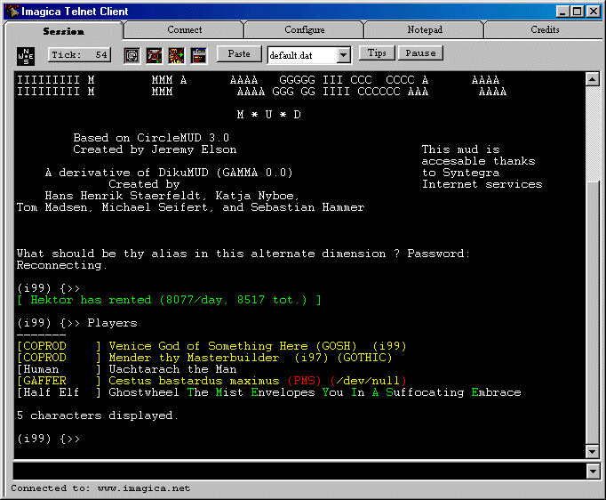

<div align="center">

## Imagica MUD Telnet client


</div>

### Description

Telnet Client, ANSI Color support, Triggers, Sound Triggers, Profile reading. FULL Finsihed Bugless Application !
 
### More Info
 
Uses Catalyst Winsock ! www.catalyst.com


<span>             |<span>
---                |---
**Submitted On**   |
**By**             |[Patrick van Venetien](https://github.com/Planet-Source-Code/PSCIndex/blob/master/ByAuthor/patrick-van-venetien.md)
**Level**          |Intermediate
**User Rating**    |4.8 (24 globes from 5 users)
**Compatibility**  |VB 4\.0 \(32\-bit\), VB 5\.0, VB 6\.0
**Category**       |[Complete Applications](https://github.com/Planet-Source-Code/PSCIndex/blob/master/ByCategory/complete-applications__1-27.md)
**World**          |[Visual Basic](https://github.com/Planet-Source-Code/PSCIndex/blob/master/ByWorld/visual-basic.md)
**Archive File**   |[](https://github.com/Planet-Source-Code/patrick-van-venetien-imagica-mud-telnet-client__1-11926/archive/master.zip)

### API Declarations

See source code, includes Profile reading, Sound api's etc etc.


### Source Code

```
Hey webmaster ! upload failed numerous times :-(
please, if you want/can put this on your site.
http://www.fictional.net/software/ImagicaTelnet/ImagicaTelnet.zip
```

